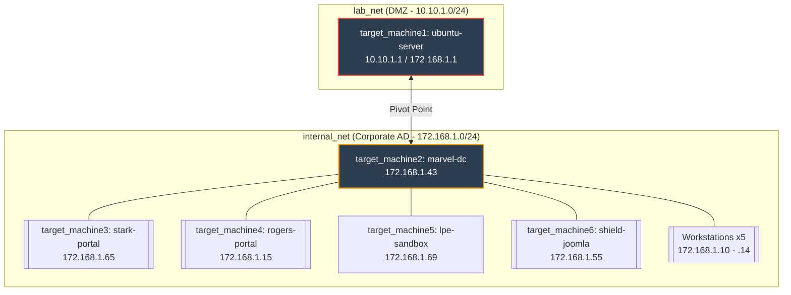

<div align="center">

  # 🛡️ Marvle-AD-Lab — Active Directory & Cyber Range Lab

  **A complete, self-contained Active Directory attack lab running purely in Docker.**<br>
  *This lab simulates an enterprise network environment featuring a Samba Active Directory Domain Controller (`marvel.local`), multiple employee workstations, pivot servers, and vulnerable web portals.*

  [](https://www.docker.com/)
  [](#prerequisites)
  [](#initial-access--footholds)
  [](LICENSE)
</div>

---

## ⚠️ Security Warning
> [!CAUTION]
> **This lab is EXTREMELY VULNERABLE by design.**
> - Never expose it to the internet
> - Use only on isolated/private networks
> - Destroy completely when not in use

---

## 🏗️ Architecture


---

## 🛠️ Prerequisites
| Requirement | Minimum |
|---|---|
| **Docker Engine** | ≥ 20.10 |
| **Docker Compose** | ≥ 2.0 |
| **OS** | Linux, Windows (WSL2 / Docker Desktop), or macOS |

---

### 🐧 Linux/macOS users:
```bash
# 1. Clone the project
git clone git@github.com:haltacademy/Marvle-AD-Lab.git
cd Marvle-AD-Lab

# 2. Deploy (automated)
./start.sh
```

### 🪟 Windows users:
```powershell
# Open PowerShell as Administrator
git clone git@github.com:haltacademy/Marvle-AD-Lab.git
cd Marvle-AD-Lab

# Deploy manually using docker compose
docker compose up -d --build
```

> [!TIP]
> **Routing to the Internal Network (Linux)**
> To access the internal subnet (`172.168.1.0/24`) directly from your Linux host machine, you can add a route pointing to the Docker gateway bridge:
> `sudo ip route add 172.168.1.0/24 via 172.168.1.254`

> [!TIP]
> **Pivoting on Windows**
> Use **SSH Dynamic Port Forwarding** through `machine1` (which exposes SSH on port `2222` to the Windows host).
> `ssh -D 1080 -N -p 2222 tonystark@127.0.0.1`

---

## 🌐 Services & Hosts
| Container Name | Hostname | IP Address | Description / Services |
|---|---|---|---|
| **`target_machine1`** | `ubuntu-server` | `10.10.1.1` | **DMZ Pivot Host** (Nginx, vsftpd, SMB, SSH, NFS, MySQL, Postfix) |
| **`target_machine2`** | `marvel-dc` | `172.168.1.43` | **Domain Controller** (Samba AD DC: LDAP, Kerberos, DNS, SMB) |
| **`target_machine3`** | `stark-portal` | `172.168.1.65` | Stark Enterprise Portal (Web App) |
| **`target_machine4`** | `rogers-portal`| `172.168.1.15` | Rogers Portal (Web App) |
| **`target_machine5`** | `lpe-sandbox`   | `172.168.1.69` | Sandbox host for local privilege escalation (SSH) |
| **`target_machine6`** | `shield-joomla` | `172.168.1.55` | Vulnerable SHIELD Joomla Portal (v4.2.5 - CVE-2023-23752) |
| **`workstations`** | `stark`, `cap`, etc. | `172.168.1.10 - .14` | 5 distinct simulated user workstations |

---

## 🔍 Initial Access / Footholds
* **FTP Server**: Accessible on `ftp://127.0.0.1:2121`. Tony Stark left a note here containing credentials and hints.
* **HTTP Portal**: Accessible on `http://127.0.0.1:80`. Contains a web panel for verification utilities.
* **SSH Pivot**: Accessible on `ssh -p 2222 tonystark@127.0.0.1`.

---

## 🛠️ Troubleshooting & Utilities
Because this lab uses static subnets, Docker may throw an error if the `172.168.1.0/24` subnet overlaps with existing interfaces or virtual networks. 

* **Fix Network Collisions**: Run the provided script if you encounter IP allocation issues.
  ```bash
  sudo bash fix_network.sh
  ```
* **Diagnose Container Health**: Run the diagnostics script to check the status of all lab components.
  ```bash
  sudo bash diagnose.sh
  ```

---

## 🧹 Cleanup
When you are done with your pentest, destroy the lab completely to free up resources.

**Linux:**
```bash
./stop.sh
```
**Windows:**
```powershell
docker compose down
```

<br>
<div align="center">
  <i>Created for educational and authorized penetration testing training only.</i>
</div>
